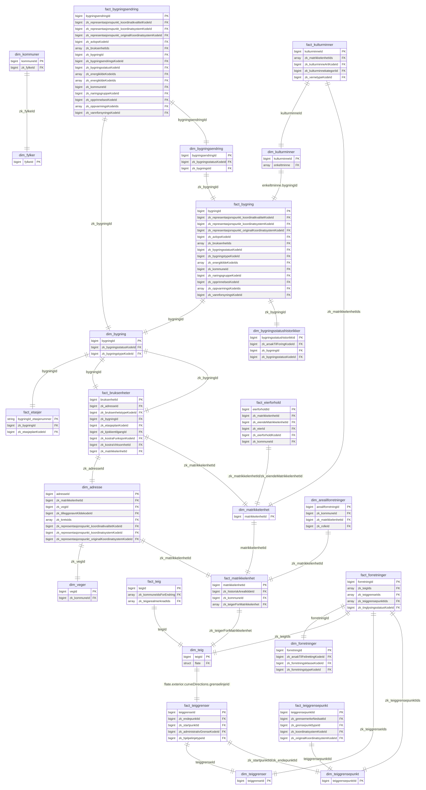

# Kv-deltashare-examples

Dette er et eksempelrepo for uthenting av data gjennom delta share sikret med Maskinporten for virksomheter invitert til lukket pilottesting.

## Flytdiagram

Tilgang og dataflyt sett fra konsumentsiden:

```mermaid
sequenceDiagram
    autonumber
    Consumer->>+Consumer: Create signed JWT grant
    Consumer->>+Maskinporten: signed JWT grant
    Maskinporten-->>-Consumer: .access_token
    Consumer->>+GCP: authenticate using workload identity provider
    GCP-->>-Consumer: successful impersonation
    Consumer->>+GCP: download file from bucket
    CGP-->>-Consumer: file config.share
    loop DeltaShareProtocol using config.share
        Consumer->>+Databricks: Shortlived accesstokens
        Databricks->>-Consumer: Data
    end
```

## Kom i gang

### Manuelt førstegangsoppsett for å lage Maskinporten-token

#### Opprett konfigurasjonsfil

Kopier og rediger `config_example.json` i `configs/config_example.json` for å lage en konfigurasjonsfil med følgende filnavn

```
configs/config.json
```

Legg inn dine spesifikke verdier fra [test](https://onboarding.test.maskinporten.no/) eller [prod](https://onboarding.maskinporten.no/) 
og last ned privat nøkkel, kid og clientid. Sett url til miljøet du har opprettet klienten i:  

```
"url": "https://sky.maskinporten.no/token" # I prod
"url": "https://test.sky.maskinporten.no/token" # I test
```


#### Legg til din private nøkkel

Plasser privatnøkkelen i:

```
certs/mp-key.pem
```

### Kjør notebook

Før du kjører notebooken, anbefales det å sette opp et virtuelt miljø for å isolere avhengigheter. Fra rotmappen i prosjektet kjører man:

```
python3 -m venv venv
```

_(Man trenger bare sette opp det virtuelle miljøet én gang)_

Hver man gang skal kjøre programmet må man aktivere det virtuelle miljøet:

```
source venv/bin/activate  # På macOS/Linux
venv\Scripts\activate     # På Windows
```

Man vil se at det virtuelle miljøet er aktivert ved å se at man får navnet på sitt viritiuell miljø i terminalen:

Installer nødvendige Python-pakker fra requirements.txt:

`pip3 install -r requirements.txt`

I notebooken kan du lese inn data. Ved å oppgi hvilken share, schema og tabell man ønsker å lese fra, kan man laste inn dataen man er tildelt som en pandas dataframe.

Når man aktivert det virtuelle miljøet og gått inn i notebooken, må det velges i kernel som kjøres i notebooken. I VSCode gjøres dette ved å trykke på knappen til øverst til høyre i notebooken.


Etter man har valgt det virtuelle miljøet i notebooken skal man kunne kjøre notebooken.

### Authenticate using workload identity federation
Autentisering og nedlasting av innhold er automatisert i notebooken `skyporten-deltashare.ipynb`.

I credentials.json, referer til:

- tmp_maskinporten_token.txt (innheolder `.access_token` som opprettes i notebooken)
- Workload Identity Provider du har rettigheter til (denne oppgir data provider).
- Service Account som impersonator (denne oppgir data provider).


## Krypterte persondata

Dette er under arbeid, se på readme i [crypto](./crypto/README.md)

## Datamodellering

Noen ting å merke seg:
* Dim-tabellene har SCD2-logikk, altså at hver oppdatering blir lagt til som en egen rad og gyldighetsrommet defineres med en from_datetime/to_datetime.
* Fact-tabellene modelleres med en tabell for nåtidsbildet og en for historikk (postfix `_historical`), altså at hver rad legges til for hver oppdatering, og oppdateringsdato eller ingest_dato brukes for å få unik rad
* En kolonne med zk-prefiks betyr at denne kolonnen er en fremmednøkkel mot en annen tabell, og brukes til å koble tabellen mot den andre tabellen med gitt nøkkel

Diagrammet under illustrerer dataene og relasjonene mellom de ulike tabellene.
1. Oversikt over matrikkel eierskap, og kobling mellom matrikkel og grunnbok via **dim_kommuner** (matrikkel), **dim_kommuner** (grunnbok) og **dim_matrikkelenhet** (matrikkel) og **dim_registerenhet** (grunnbok).

2. Oversikt over grunnbok eierskap

3. Her viser vi kun primærnøkler og fremmednøkler, mens øvrige kolonner i hver tabell ikke er skissert opp her. For å hente ut fullstendig beskrivelse av alle kolonnene, kan man benytte funksjonen `get_table_metadata` beskrevet i skyporten-deltashare.ipynb For å å forenkle skissen er ikke kobling mot kommune vist for aktuelle tabeller, men kobles sammen med `zk_kommuneId` for tabellene som har denne kolonnen


## Annet 

### Oppdateringsfrekvens

Vi oppdaterer dataene en gang i døgnet pt (oppdateringsvindu = 24 timer). For matrikkeldata er kilden Matrikkelen sin endringslogg.

Dersom det er flere endringer på samme objekt innenfor oppdateringsvinduet, vil vi kun registere den siste endringen for å få korrekt oppdateringstid/endringstidspunkt.


### Versjonering 

Målet er å holde dataproduktene stabile. Breaking changes skal varsles, i starten kan det være litt oftere, men etterhvert som produktene er gjennom utviklingsfasen vil vi varsle i forkant. 

Nye kolonner vil kunne legges til i eksisterende dataprodukter uten varsling og dette må håndteres av nedstrøms konsumenter. Transaksjonsloggen i deltashare skal sørge for at nye kolonner populeres med ny data.

###  FAQ

> *dim_adresse* har noen innslag hvor `to_datetime = null`, hvordan skal vi tolke disse resultatene.

Disse adressene må behandles som gyldige adresser, tilsvarende de som har et fremtidig timestamp.

> Pandas gir meg ingen datoer frem i tid, hva skjer?

Pandas får en overflow på tid når vi bruker fremtidig dato 9999-01-01. Denne blir dermed 1815.  
