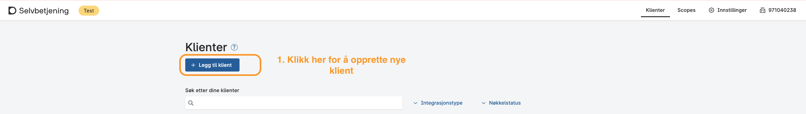
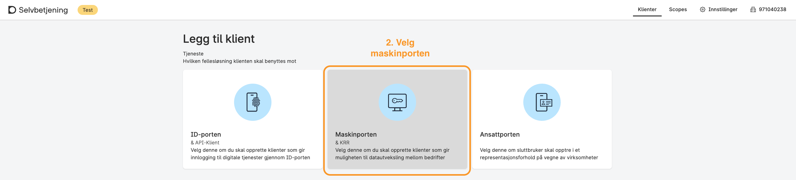
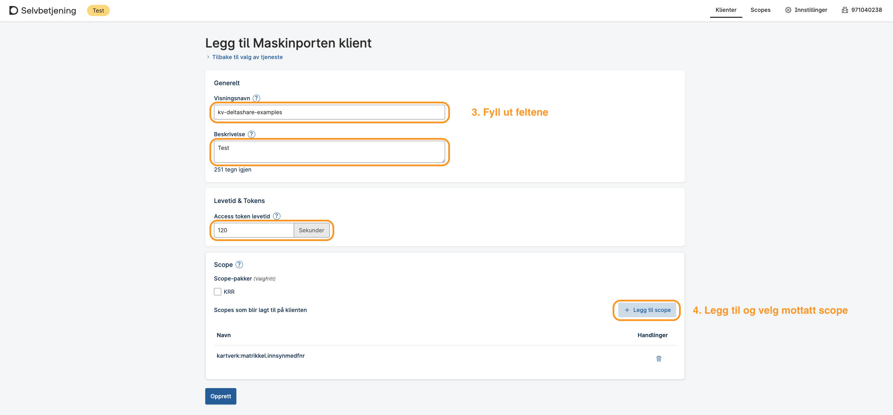
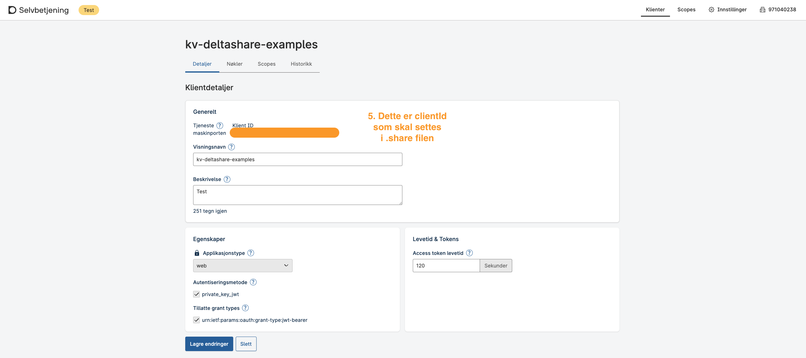
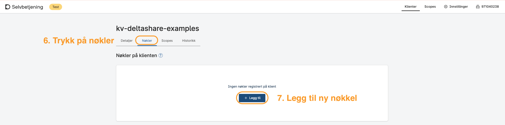
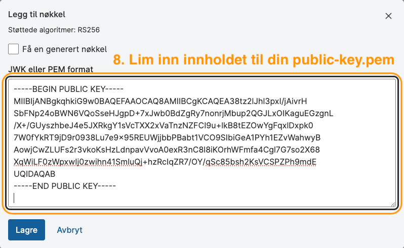
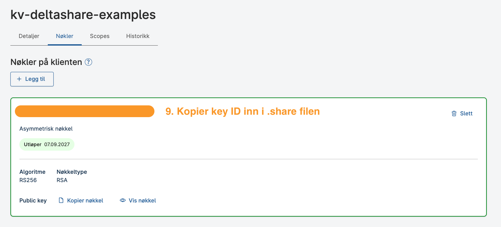

# Kartverkets Delta Share Eksempler

Dette er et eksempelrepo for uthenting av data gjennom delta share sikret med Maskinporten for virksomheter. 

Dersom du har vært med i uttesting av dette i pilotperioden kan du finne gammel dokumentasjon på github taggen [pilot](/tags/pilot).

## Slik henger det sammen

For å hente data trenger du:

1. **Avtale med Kartverket** om tilgang til dataproduktet.
2. **En Maskinporten-klient** som beviser hvem du (virksomheten) er.

Autentiseringen fungerer slik: Delta Sharing-klienten din signerer en JWT med en **privat nøkkel** som bare ligger på din maskin. Maskinporten verifiserer signaturen med den tilhørende **offentlige nøkkelen** du har lastet opp hos dem, og utsteder et access-token som Kartverket godtar.

### Før du begynner

Kontakt post@kartverket.no for å be om avklaring rundt tilgang. Du vil motta:

- **Portal-link** til Databricks (som du åpner i nettleser og laster ned `config.share` fra), eller **`endpoint`-URL** direkte.
- **`scope`** — Maskinporten-scopet knyttet til dataproduktet (f.eks. `kartverk:matrikkel.innsynmedfnr`).
- **`audience`** — mottaker JWT-en skal utstedes til.

Kartverket sørger for at scopet er delegert til virksomhetens organisasjonsnummer i Maskinporten. Test- og prod-miljøet er atskilte: du får én recipient-URL per miljø, og må opprette klient i tilsvarende Maskinporten-miljø.

Verdiene du samler inn ender i én fil, `config/oauth_config.share`:

| Verdi | Kommer fra | Steg |
|-------|------------|------|
| `endpoint` | Kartverket (portal-link eller direkte URL) | Steg 4 |
| `scope` | Kartverket | Steg 4 |
| `clientId` | Maskinporten (Selvbetjening) | Steg 2 |
| `keyId` | Maskinporten (Selvbetjening) | Steg 3 |

## Struktur

- [main.py](main.py) — lister tilgjengelige tabeller eller henter en tabell.
- [config/oauth_config.example.share](config/oauth_config.example.share) — mal for prod-profil.
- [config/oauth_config_test.example.share](config/oauth_config_test.example.share) — mal for testmiljøet.
- [examples/preview_first_ten_rows_of_shared_table.py](examples/preview_first_ten_rows_of_shared_table.py) — de 10 første radene fra en delt tabell.
- [examples/show_metadata_for_shared_table.py](examples/show_metadata_for_shared_table.py) — skjema/kolonner for en delt tabell.
- [docs/dataflyt.mermaid](docs/dataflyt.mermaid) — dataflyt mellom konsument, Maskinporten (Skyporten) og Databricks.
- [docs/matrikkelen-utlevering-med-fodselsnummer.md](docs/matrikkelen-utlevering-med-fodselsnummer.md) — tabelldokumentasjon for Matrikkelen utlevering med fødselsnummer.

## Kom i gang

### 1. Opprett nøkkelpar

Du trenger et RSA-nøkkelpar: en **privat nøkkel** som blir liggende lokalt og signerer token, og en **offentlig nøkkel** som du senere laster opp i Maskinporten (steg 3). Den private nøkkelen skal aldri deles eller committes.

> **Windows:** Windows leveres ikke med `openssl`. Åpne **Git Bash** (fra Start-menyen — følger med Git for Windows) og kjør kommandoene under der. PowerShell fungerer ikke for dette steget.

```bash
mkdir -p keys
openssl genrsa -out keys/private-key.pem 2048
openssl rsa -in keys/private-key.pem -pubout -out keys/public-key.pem
```

Resultat: to filer i `keys/`. `public-key.pem` bruker du i steg 3, `private-key.pem` refereres fra profilen i steg 4.

### 2. Opprett Maskinporten-klient

Kort versjon:
Du er nødt til å opprette en klient i Maskinporten, som du knytter til motatt scope fra oss, og legger til din offentlig nøkkel. Du vil motta en klient-ID og nøkkel-ID som du må bruke i Delta Sharing-profilen.

Detaljert oppsett *(skjermbildene under er fra `test.samarbeid.digdir.no` — prod-Selvbetjening ser tilnærmet likt ut på `sjolvbetjening.samarbeid.digdir.no`)*:






### 3. Registrer offentlig nøkkel

På klienten, velg **Nøkler** og legg til en ny nøkkel. Lim inn innholdet i
`keys/public-key.pem`, lagre og noter nøkkelens `keyId`.





### 4. Opprett Delta Sharing-profil

Nå samler du alle verdiene i konfigfila som Delta Sharing-klienten leser.

Kopier [config/oauth_config.example.share](config/oauth_config.example.share) til `config/oauth_config.share` (for prod) og/eller `config/oauth_config_test.example.share` til `config/oauth_config_test.share` (for test).

Fyll inn feltene:

- `endpoint` — recipient-URL fra Kartverket. Se boks under.
- `scope` — scopet du mottok fra Kartverket.
- `audience` — mottakeren i JWT-en, oppgitt av Kartverket.
- `clientId` — fra Maskinporten (steg 2).
- `keyId` — fra Maskinporten (steg 3).
- `privateKeyFile` — sti til `keys/private-key.pem` fra steg 1.
- `tokenEndpoint` / `issuer` — `https://sky.maskinporten.no(/token)` for prod, `https://test.sky.maskinporten.no(/token)` for test.

> **Slik henter du `endpoint`:** Kartverket sender ofte en Databricks-portal-link på formen:
>
> ```
> https://europe-west1.gcp.databricks.com/delta-sharing/oidc-profile-generation?metastoreId=...&recipientId=...&policyId=...
> ```
>
> Dette er *ikke* endpoint-URL-en. Åpne linken i nettleseren, last ned `config.share`-fila den genererer, og bruk `endpoint`-verdien derfra i din egen profil.

Profilen skal se slik ut:

```json
{
  "shareCredentialsVersion": 2,
  "type": "oauth_jwt_bearer_private_key_jwt",
  "endpoint": "[ENDPOINT_URL_FROM_KARTVERKET]",
  "auth": {
    "tokenEndpoint": "[MASKINPORTEN_TOKEN_ENDPOINT]",
    "clientId": "[MASKINPORTEN_CLIENT_ID]",
    "issuer": "[MASKINPORTEN_ISSUER]",
    "audience": "[AUDIENCE_FROM_KARTVERKET]",
    "scope": "[SCOPE_FROM_KARTVERKET]",
    "privateKey": {
      "privateKeyFile": "keys/private-key.pem",
      "keyId": "[MASKINPORTEN_KEY_ID]",
      "algorithm": "RS256"
    }
  }
}
```

### 5. Installer avhengigheter og hent ut share data

Velg **én** av metodene under. Du trenger bare gjøre dette én gang.

#### Alternativ A: `uv` (anbefalt)

```bash
uv sync
uv run main.py
```

#### Alternativ B: Python venv (macOS / Linux)

```bash
python3 -m venv .venv
source .venv/bin/activate
python -m pip install .
python main.py
```

#### Alternativ C: Python venv (Windows PowerShell)

```powershell
py -3 -m venv .venv
.\.venv\Scripts\Activate.ps1
python -m pip install .
python main.py
```

Uansett metode: skriptet lister tabellene du har tilgang til. Bytt profil (test/prod) med `--profile`:

```bash
uv run main.py --profile config/oauth_config_test.share    # test
uv run main.py --profile config/oauth_config.share         # prod (default)
```

Hent en spesifikk tabell:

```bash
uv run main.py --table SHARE.SCHEMA.TABLE
```

Tabellnavn med æ/ø/å må quotes:

```bash
uv run main.py --table "kartverket_matrikkelen_utlevering_med_fødselsnummer_v1.gold.dim_fylke_v1"
```

## Eksempler

Eksemplene tar en fullt kvalifisert tabell på formen `SHARE.SCHEMA.TABLE`.

```bash
uv run examples/preview_first_ten_rows_of_shared_table.py --table SHARE.SCHEMA.TABLE
uv run examples/show_metadata_for_shared_table.py --table SHARE.SCHEMA.TABLE
```

## Feilsøking

### `401 UNAUTHENTICATED: TOKEN_ISSUER_INVALID`

Recipienten din stoler ikke på Maskinporten-issueren i tokenet. Vanlig årsak: test-recipient-URL brukt med prod-Maskinporten (eller omvendt). Kontakt Kartverket for riktig recipient-URL for det miljøet du autentiserer mot.

### `JSONDecodeError: Expecting value: line 1 column 1 (char 0)`

Auth fungerer, men serveren returnerer tom respons. Sannsynligvis er ingen shares tildelt recipienten din ennå. Kontakt Kartverket for å få shares tildelt.

### `openssl: command not found` på Windows

PowerShell har ikke `openssl`. Bruk Git Bash (kommer med Git for Windows) — se steg 1.

### Feil profil velges

`main.py` bruker `config/oauth_config.share` som default. Bruk `--profile` for å peke på en annen fil:

```bash
uv run main.py --profile config/oauth_config_test.share
```

## Datamodellering

Se [tabelldokumentasjonen](docs/matrikkelen-utlevering-med-fodselsnummer.md)
for tilgjengelige tabeller og kolonner. Relasjonsskisser kan ligge sammen med
denne dokumentasjonen ved behov.

## Annet

### Oppdateringsfrekvens

Vi oppdaterer dataene en gang i døgnet pt (oppdateringsvindu = 24 timer). For matrikkeldata er kilden Matrikkelen sin endringslogg.

### Versjonering

Målet er å holde dataproduktene stabile. Generelt må konsumenter forvente at nye kolonner vil kunne legges til i eksisterende dataprodukter uten varsling. Dette må håndteres av nedstrømskonsumenter.
